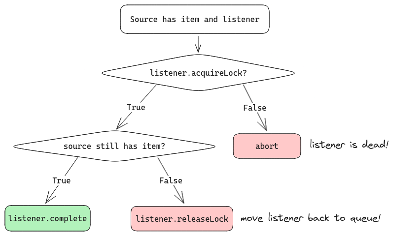

# Locking and Failible Listeners

As mentioned in the previous section, `dropListener` is not a perfect solution when it comes
to managing listeners:
`dropListener` is run possibly at a *different* thread than the one processing the `Source` items,
which means there is no guarantee that calling `dropListener` *before* the listener is resolved
will cause the listener to _not_ be resolved.

However, sometimes we do want to achieve this guarantee.
To do so, Gears allow a listener to declare itself _dead_, and `Source`s calling a dead listener
should not be consuming the item to the listener.

How does that work in details, how do we declare a failible listener and how do we handle them?

## The `Listener` trait

Let's look at the [`Listener`](https://lampepfl.github.io/gears/api/gears/async/Listener.html) trait in detail:

```scala
trait Listener[-T]:
  def complete(item: T, origin: Source[T]): Unit
  val lock: ListenerLock | null

trait ListenerLock:
  val selfNumber: Long
  def acquire(): Boolean
  def release(): Unit
```

We've seen the `complete` method before in the [`Source` section](./sources.md), which simply
forwards the item to the listener, "completing" it.

However, a `Listener` may also declare itself to have a [`lock`](https://lampepfl.github.io/gears/api/gears/async/Listener.html#lock-0),
which must be acquired _before_ calling `complete`.
Most listeners are however _not_ failible and does _not_ require a lock, and so in such case the `Listener`
just declare `lock = null`.

The listener lock:
- Returns a boolean in its [`acquire`](https://lampepfl.github.io/gears/api/gears/async/Listener$$ListenerLock.html#acquire-fffff760) method:
  failing to acquire the lock means that the listener is _dead_, and should not be completed.
  - For performance reasons, they are *blocking* locks (no `using Async` in `acquire`): `Source`s should be quick in using them!
- Has a [`release`](https://lampepfl.github.io/gears/api/gears/async/Listener$$ListenerLock.html#release-94c) method:
  in case that the `Source` no longer has the item *after* acquiring the lock, it can be `released` without completing the `Listener`.
  It does **not** have to be run when the `Listener` is `complete`d: the `Listener` will release the lock by itself! (See the diagram below)
- Exposes a [`selfNumber`](https://lampepfl.github.io/gears/api/gears/async/Listener$$ListenerLock.html#selfNumber-0), which is required
  to be **unique for each `Listener`**.

  This is used in the case where a `Source` needs to synchronize between multiple listeners, to prevent deadlocking.

  One can simply use a [`NumberedLock`](https://lampepfl.github.io/gears/api/gears/async/Listener$$NumberedLock.html) to implement
  `ListenerLock` with the appropriate numbering.

## Source and Listener interaction

The diagram for the handshake process between a `Source` and a `Listener` is as follow:



However, if `Source`'s status for the item never changes (item is always available),
[`Listener.completeNow`](https://lampepfl.github.io/gears/api/gears/async/Listener.html#completeNow-fffff34e)
is a shortcut handler for the entire flow, only letting you know whether the listener was alive and
received the item.

The handshake process also allows for more complex scenarios, involving synchronization of multiple handlers.
For example,
the implementation of [`SyncChannel`](https://github.com/lampepfl/gears/blob/main/shared/src/main/scala/async/channels.scala)
involves a *sending* and a *receiving* listener both being alive to proceed.
We shall not go into details in this guide.
